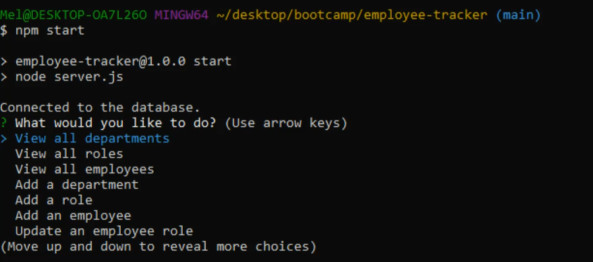
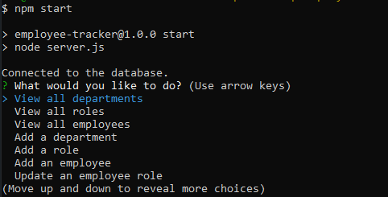
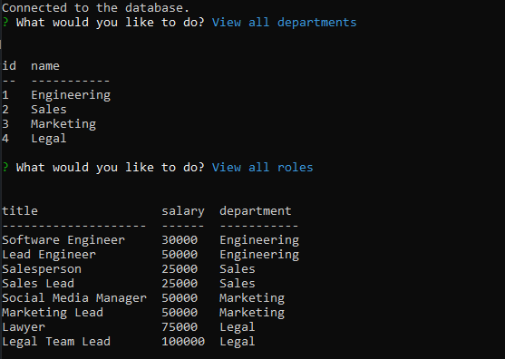
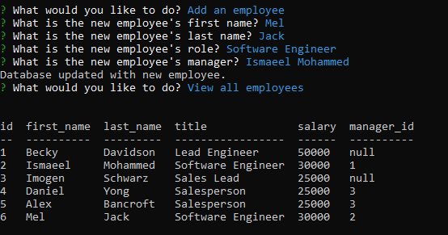

# employee-tracker [](https://opensource.org/licenses/MIT)

## Table of Contents
* [Description](#description)
* [Installation](#installation)
* [Usage](#usage)
* [License](#license)
* [How to Contribute](#how-to-contribute)
* [Contact](#contact)

## Description
An employee-tracker application written to better familiarise myself with MySQL databases and Express.js servers. This was my first time manipulating a database using JavaScript, and I learned a lot about MySQL syntax during the creation of this application.

## Installation
Navigate to ```./employee-tracker```

Run the following command from the terminal: 

```npm i```

## Usage
1. Ensure MySQL is installed and set up on your computer before using this application. A guide can be found [here](https://dev.mysql.com/doc/mysql-installation-excerpt/5.7/en/)

2. Navigate to ```./employee-tracker```

3. Initialise the database by running the following commands in the terminal: 
```mysql -u root -p```
```source db/schema.sql```
```source db/seeds.sql```

4. In ```server.js```, update the password (line 19) to your own MySQL password. For example: 
```password: 'MyPassword123'```

5. Run the following command from the terminal: 

```node server.js```

Click the image below for a tutorial video:

[](https://watch.screencastify.com/v/AnDuf9htbK89pumkipdm)

Screenshots:





## License 
This project is covered under the MIT License: [](https://opensource.org/licenses/MIT)

## How to Contribute
Fork the repository or contact me using the details shown below

## Contact
Please feel free to contact me through GitHub or email, using the following details: 

Email: mel.jack.developer@gmail.com

GitHub: [meljack1](https://github.com/meljack1/)
